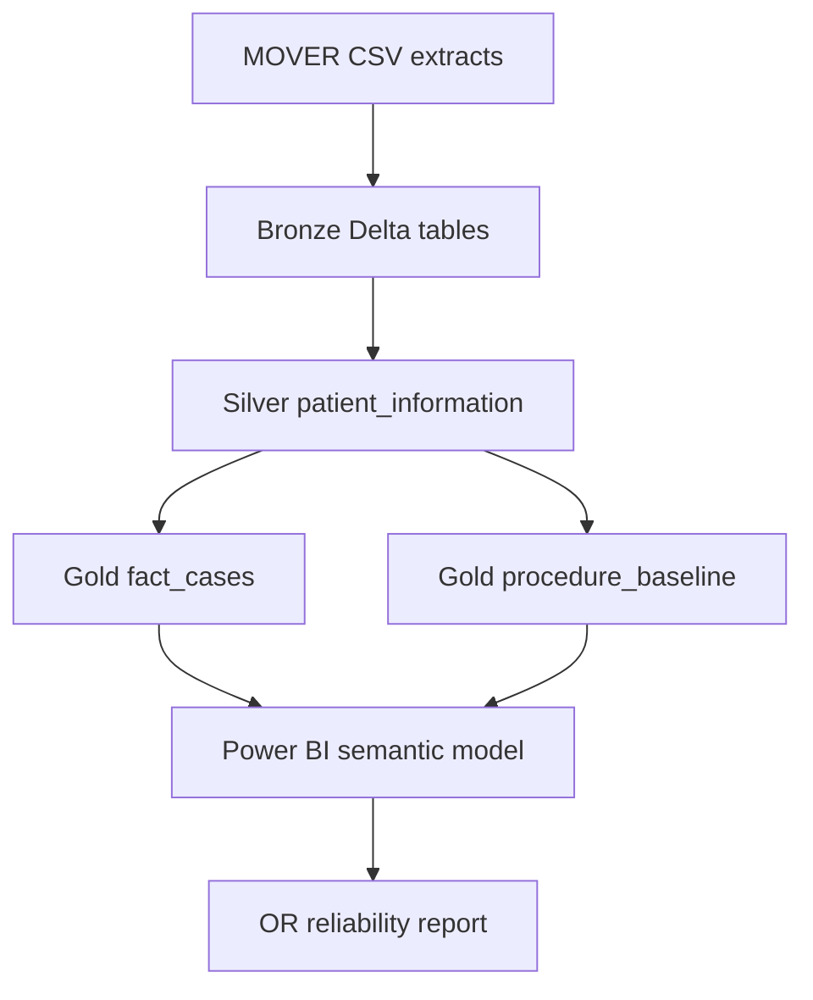
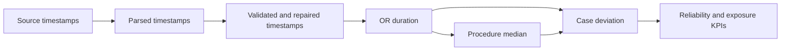
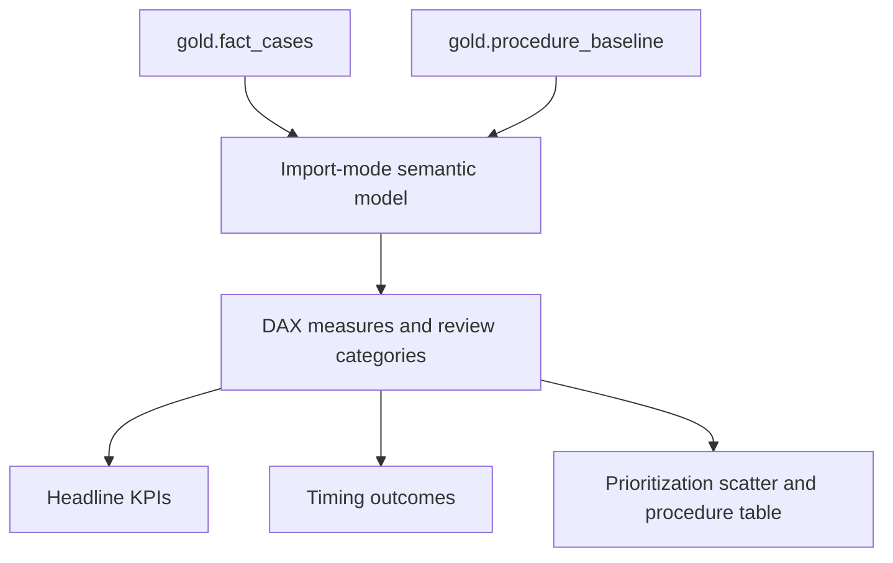

# Data Lineage

## Purpose

This document shows how data moves from the MOVER CSV extracts through Microsoft Fabric and into the Power BI report. It describes the current implemented path, not a future-state architecture.

Data-quality rules and feature definitions are documented in [DATA_QUALITY.md](DATA_QUALITY.md).

## End-to-end flow

Only `patient_information.csv` currently continues beyond Bronze. The history, procedure-event, and complication extracts are staged but do not contribute to the present findings or dashboard metrics.

## Source-to-table lineage

| Source file | Bronze destination | Silver destination | Gold destination | Current use |
|---|---|---|---|---|
| `patient_information.csv` | `bronze.patient_information` | `silver.patient_information` | `gold.fact_cases`, `gold.procedure_baseline` | Current analysis and report |
| `patient_history.csv` | `bronze.patient_history` | — | — | Future scope |
| `patient_procedure_events.csv` | `bronze.patient_procedure_events` | — | — | Future scope |
| `patient_post_op_complications.csv` | `bronze.patient_post_op_complications` | — | — | Future scope |

## Layer responsibilities

### Bronze

Bronze preserves the four CSV extracts as received:

- all fields are initially stored as strings
- no values are cleaned, renamed, cast, or filtered
- row and column counts are checked before and after the Delta write

### Silver

`silver.patient_information` is the case-level quality layer. It:

- standardizes names, whitespace, types, and categorical values
- removes exact duplicates and resolves duplicate `log_id` values
- parses OR and anesthesia timestamps
- validates and repairs timestamps using anesthesia as a second clock
- standardizes procedure names
- creates reusable duration and case attributes
- preserves corruption, compound-name, and repair flags

Final output: **64,353 rows**.

### Gold

Gold applies analytical eligibility and separates the model into two grains:

| Gold table | Grain | Rows | Purpose |
|---|---|---:|---|
| `gold.fact_cases` | One row per qualifying surgical case | 48,118 | Case-level durations, deviation measures, flags, and descriptive attributes |
| `gold.procedure_baseline` | One row per qualifying procedure | 418 | Historical duration baseline, variability, volume, and accumulated exposure |

The procedure table includes only procedures with at least 30 qualifying cases. The case table inherits that cohort through its join with the procedure baseline.

## Core field lineage

| Report concept | Gold field or calculation | Silver origin | Source origin |
|---|---|---|---|
| Actual OR duration | `or_duration_min` | Difference between repaired `in_or` and `out_or` | `in_or_dttm`, `out_or_dttm` |
| Expected duration | `expected_duration_min` | Median of qualifying `or_duration_min` by `procedure_nm` | Procedure and OR timestamps |
| Signed scheduling difference | `schedule_error_min` | Actual duration minus expected duration | Derived in Gold |
| Absolute scheduling difference | `abs_error_min` | Absolute value of `schedule_error_min` | Derived in Gold |
| Overrun flags | `overrun_30`, `overrun_60` | Thresholds on `schedule_error_min` | Derived in Gold |
| Early-finish flag | `early_30` | Threshold on `schedule_error_min` | Derived in Gold |
| Procedure variability | `cv` | Standard deviation divided by mean duration | Derived in Gold |
| Procedure exposure | `total_deviation_min` | Sum of `abs_error_min` by procedure | Derived in Gold |
| Annualized variation | Total absolute deviation ÷ 5.75 | Gold deviation totals | Report/model calculation |
| Gross cost exposure | Annualized variation × $35 or $60 | Annualized variation | Report/model scenario |

## Transformation lineage

Every timestamp modification is represented by a repair flag before the derived durations are created. Gold uses the repaired duration but omits the validation-only anesthesia fields that are no longer required for the report.

## Power BI lineage

The case table supplies portfolio-level counts, averages, medians, and timing outcomes. The procedure table supplies baseline and procedure-comparison context. Keeping the two grains distinct prevents procedure-level percentages from being incorrectly averaged into case-level KPIs.

## Execution order

1. Run `01_bronze_ingest.ipynb` to load and reconcile the four source extracts.
2. Run `02_silver_patient_information.ipynb` to build the cleaned case-level table.
3. Run `03_gold.ipynb` to create the procedure and case analytical tables.
4. Refresh the Power BI Import-mode semantic model.
5. Validate report totals against the Gold reconciliation outputs.

## Lineage controls

| Control | Current status |
|---|---|
| Bronze source/write count reconciliation | Implemented |
| Deterministic duplicate resolution | Implemented |
| Timestamp repair flags | Implemented |
| Silver row-count and lowercase-schema assertions | Implemented |
| Fact-to-procedure total-deviation reconciliation | Implemented; totals match at 2,600,928 minutes |
| Source-schema contract | Not implemented |
| Automated schema-drift detection | Not implemented |
| Ingestion audit metadata | Not implemented |
| Automated Power BI regression checks | Not implemented |

## Interpretation boundaries

- MOVER's patient-specific date shifting prevents valid cross-patient calendar trend analysis.
- The model uses historical median duration because booked schedule duration is not available.
- The three Bronze tables without downstream connections are not part of the current report lineage.
- Annualized time and cost figures are calculated scenarios, not observed accounting losses or guaranteed savings.

## Planned lineage extensions

- Add column-level lineage for DAX measures after the final semantic-model source files are committed.
- Add refresh timestamps, run identifiers, and source file metadata to Bronze.
- Extend the diagram only when the history, events, or complications tables support a defined and validated analytical question.
- Add actual booked-duration data if available, creating a direct lineage path for true schedule-adherence measures.
