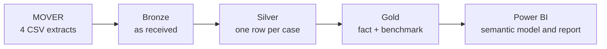

# OR Scheduling Reliability & Cost Exposure

**How far operating room cases run from their procedure's historical benchmark, what that variation is worth in a year, and which procedures to review first.**

### **[▶ Open the live dashboard](https://thrinesh13.github.io/OR-Scheduling-Reliability-Analytics/)**

*No sign-in. No install. No Power BI licence.*

| **48,118** | **418** | **46.7%** | **$15.8M to $27.1M** |
|:---:|:---:|:---:|:---:|
| Surgical cases | Procedures benchmarked | Land within ±30 min | Annual gross exposure |

---

## Overview

Every surgery booked in a hospital starts with an estimate of how long it will take. That estimate decides the room, the start time, the staff held for it, and how many other cases fit behind it. Almost nobody checks afterwards whether it was any good.

This project checks it across 48,118 cases and 5.75 years at UC Irvine Medical Center, then turns the answer into a ranked list of which procedures are worth a scheduling committee's time.

## Business Case

A wrong estimate costs money the same day. Run long and you pay overtime and delay every case behind. Finish early and a fully staffed room sits idle.

**53.3% of cases missed the procedure's own historical median by more than 30 minutes.** That is **7,539 hours a year**, close to 28% of the room time those cases used, worth **$15.8M to $27.1M** at $35 to $60 per operating room minute.

Overruns get tracked. Early finishes do not, and they alone account for **2,167 hours a year**, one operating room idle every working day.

## Business Questions

1. **How far do case durations run from the procedure's historical median, and how often?**
2. **Do the misses run late, early, or both?**
3. **What is that variation worth in a year?**
4. **Which procedures should be reviewed first, and which can be left alone?**

> [!NOTE]
> Questions 1 to 3 size the problem. Question 4 is what the report is built around: all 418 procedures ranked on time variation and reliability at once, so a large predictable procedure is separated from a small erratic one.

| Audience | Decision it informs |
|---|---|
| Perioperative and OR leadership | Which procedures go on the review agenda, in what order |
| Scheduling and block time committees | How much time to allow per procedure, and in which direction |
| Finance and capacity planning | Whether a capacity problem is a booking problem before capital is committed |

## Scope

| In scope | Out of scope |
|---|---|
| How far each case runs from the time that procedure normally takes | Whether cases met their booked time. The source records no booked time |
| Where the variation concentrates across the 418 procedures | Why it happens. No cause and effect analysis was attempted |
| A ranked review list with the size of each entry attached | Predicting how long an individual case will take |

---

## Dataset

Source is **[MOVER](https://doi.org/10.24432/C5VS5G)**, a de-identified perioperative dataset released by UC Irvine Medical Center. Access requires a data use agreement, so **no raw records are committed here**. Four extracts totaling about 1.88 million rows were loaded; only patient information carries through to the analysis.

| Checkpoint | Rows | What happened |
|---|---:|---|
| Raw `patient_information` | 65,728 | Source, as received |
| After trim and exact deduplication | 64,362 | 1,366 identical rows removed |
| After duplicate `log_id` resolution | 64,354 | One row kept per case, chosen by a deterministic rule |
| Final Silver | 64,353 | One timestamp outlier excluded, as it could not be explained |
| With a usable OR duration | 57,861 | Both OR timestamps present and repaired |
| **Gold analysis cohort** | **48,118** | Duration and procedure volume eligibility applied |

**Cleaning barely moved the headline figures, and establishing that was the point.** Mean absolute error went from 54.0 to 54.1 minutes and the median held at 33.0, after removing the duplicates and repairing 13 corrupt timestamps. Duplicate rows that copy typical cases shift counts and sums rather than averages. The sums did move, and the cost figure is built on a sum.

## Methodology

**The benchmark is each procedure's historical median duration**, not a mean, because the duration distribution is right skewed: a handful of very long cases would pull a mean upward and classify ordinary cases as finishing early.

**A procedure needs 30 qualifying cases before it earns a benchmark.** This was tested rather than assumed. Procedures in the lowest volume quartile miss the 30 minute band 61.5% of the time against 55.2% in the highest, so raising the floor would cost coverage and gain very little precision.

**Early finishes are counted alongside overruns**, which changed the conclusion, since they occur nearly as often and consume the same staffed room.

**Cohort percentages are calculated from the 48,118 row case table**, not averaged from the 418 per-procedure rates, which would weight a 30 case procedure the same as a 900 case one. The two approaches give 53.28% and 58.4%, and both are correct for different questions.

---

## Key Findings

### 1. Cases run both long and short, in similar numbers

| Compared with the procedure's historical median | Cases | Share |
|---|---:|---:|
| More than 30 min **early** | 11,339 | **23.56%** |
| **Within ±30 min** | 22,481 | **46.72%** |
| 30 to 60 min **late** | 5,077 | 10.55% |
| More than 60 min **late** | 9,221 | 19.16% |

Standard operating room reporting counts only the late cases, which leaves close to half the measured problem outside the reports leadership receives.

### 2. The mean is not the typical case

Mean absolute error is **54.1 minutes** while the median is **33.0**. A small number of very large misses pulls the mean more than 20 minutes above the typical case, so any target set from the mean would be wrong for most cases and still too generous for the tail.

### 3. A third of procedures account for half the variation

| | Procedures | Cases | Annualized variation |
|---|---:|---:|---:|
| Above the cohort median on **both** measures | **133** (31.8%) | 18,296 (38.0%) | **242,323 min (53.6%)** |
| Everything else | 285 | 29,822 | 210,012 min |

A list of 418 procedures gets read once and abandoned. A list of 133, ordered, with the size of each attached, is a few committee meetings of work.

### 4. Some procedures are already predictable

**73 procedures keep more than 70% of their cases within 30 minutes of benchmark**, and 42 stay above 80%. These are not small samples.

| Procedure | Cases | Benchmark | Outside ±30 min |
|---|---:|---:|---:|
| DILATION AND CURETTAGE | 320 | 62 min | 11.3% |
| HYSTEROSCOPY, WITH BIOPSY OR POLYPECTOMY | 192 | 73 min | 12.5% |
| IR PLCMT TUNNELED CATH | 143 | 73 min | 13.3% |
| BIOPSY, MUSCLE | 106 | 70 min | 8.5% |

Every procedure on that list is short, which raises an obvious question.

### 5. The 30 minute rule is harder on long procedures than short ones

| Procedure length | Benchmark range | Outside ±30 min | Mean error as a share of the benchmark |
|---|---|---:|---:|
| Shortest quartile | 28 to 110 min | **25.4%** | 32.9% |
| Second quartile | 111 to 165 min | 54.0% | 34.3% |
| Third quartile | 165 to 252 min | 65.4% | 29.6% |
| Longest quartile | 252 to 601 min | **74.2%** | **24.4%** |

The miss rate triples from the shortest quartile to the longest, while error measured against the procedure's own length actually falls. Thirty minutes is a generous allowance on a one hour case and a tight one on a seven hour case, so the rule partly measures how long a procedure is rather than how predictable it is.

| Procedure | Cases | Benchmark | Outside ±30 min | Mean error vs benchmark |
|---|---:|---:|---:|---:|
| CABG (coronary artery bypass graft) | 416 | 414 min | 68.0% | **14.4%** |
| EGD (esophagogastroduodenoscopy) | 434 | 67 min | **32.9%** | 43.6% |

CABG is among the most predictable procedures in the cohort once its length is taken into account, and the 30 minute rule places it with the worst. **A committee working from that list would review the wrong one of these two.**

---

## Business Impact

| | Per year |
|---|---:|
| Total absolute deviation from benchmark | 452,335 min, or **7,539 hours** |
| Room time lost to cases finishing early | **2,167 hours** |
| Gross exposure at $35 per OR minute | **$15.8M** |
| Gross exposure at $60 per OR minute | **$27.1M** |

> [!NOTE]
> **This is a scenario, not a loss.** The benchmark is the median of observed durations, so roughly half of every procedure's cases fall above it by construction. Most of the measured difference is the natural variability of surgery rather than a mistake anyone made, and separating the two would require booked durations this dataset does not contain. Read the range as an upper bound on what better estimating could address.

**Overruns and early finishes are not equal in size.** Cases run long slightly more often than they run short, 1.26 to 1, but when they run long the overshoot is much larger: **107.8 minutes on average against 65.9 minutes** when they finish early, a pattern holding for **388 of the 418 procedures**. Anchoring bookings at the median therefore loses more time to overruns than it recovers from early finishes, roughly **2,300 hours a year**, and that trade is currently being made by default rather than by choice.

## Recommendations

None of these has been tested against a change in practice. They say where to look and what to check.

**1. Work the 133 procedures above the cohort median on both measures, in order.** They return the most ground covered per hour of review time.

**2. Choose the booking anchor per procedure, on purpose.** Padding everything reduces overruns and makes the idle hours worse. The decision is which point of the distribution to book against, and it should differ by procedure.

**3. Check the benchmark before checking the team.** **207 procedure names** were flagged during cleaning as covering more than one operation, which inflates the variation without anything going wrong in the room. They are the cheapest thing to fix first.

**4. Report a percentage tolerance alongside the 30 minute one**, so long but well estimated procedures do not crowd out those that need attention. Standard deviation and coefficient of variation per procedure are already calculated in `gold.procedure_baseline` and currently unused.

**5. Start recording booked duration.** The single change that would separate an estimating problem from a natural variability problem.

## Limitations

The benchmark is not a schedule. It is the procedure's historical median, because the source records no booked time.

| Limit | Consequence |
|---|---|
| A poor estimate cannot be separated from a naturally variable case | Without a booked duration, the two look identical in this data |
| The benchmark is retrospective | Built from the same cases it is measured against, with no holdout period |
| The 30 minute band favours short procedures | Quantified in finding 5. Any ranking from it needs a percentage check alongside |
| Rare procedures are excluded | 16.8% of cases with a usable duration fall outside the cohort, mostly on volume |
| Calendar analysis is not possible | Dates are shifted per patient, so seasonality and weekday effects cannot be read |
| Age is top-coded at 90 | De-identification leaves the oldest band a mixed group |
| OR duration is room occupancy | Entry to exit, not incision to close, so turnover sits inside the measure |
| Cost rates are assumptions | $35 and $60 per minute are illustrative, not any hospital's costed rates |

---

## Architecture

**Microsoft Fabric** lakehouse with Delta tables and a SQL analytics endpoint · **PySpark** and **Spark SQL** across all three layers · **Data Factory pipeline** chaining the notebooks and the semantic model refresh · **Power BI Desktop** for the data model and the report · **DAX**

| Layer | What it does | Notebook |
|---|---|---|
| **Bronze** | Loads all four extracts as strings with `inferSchema=False`, then reads each Delta table back and reconciles row and column counts against the source | [`01_bronze_ingest`](notebooks/01_bronze_ingest.ipynb) |
| **Silver** | Resolves duplicates, parses timestamps, repairs what the evidence supports, and flags every value it changes | [`02_silver_patient_information`](notebooks/02_silver_patient_information.ipynb) |
| **Gold** | Applies eligibility and splits into two grains, one row per case and one row per procedure. The 30 case rule lives in a single join | [`03_gold`](notebooks/03_gold.ipynb) |

The **semantic model** holds two tables, one bidirectional relationship, 17 DAX measures and five calculated columns. All three notebooks are idempotent, so the pipeline lands in the same state every run. Modelling decisions, including the bidirectional relationship and the `ALL()` behaviour it breaks, are documented in [MODEL_REFERENCE.md](powerbi/MODEL_REFERENCE.md).

**Workspace**

**Lineage**

**Bronze, Silver and Gold schemas in the lakehouse**

**Pipeline run, five activities, about 7 minutes end to end**

**Headline figures queried at source through the SQL analytics endpoint**

**Semantic model**

---

## Repository

| | |
|---|---|
| **Dashboard** | [Live version](https://thrinesh13.github.io/OR-Scheduling-Reliability-Analytics/) · [`index.html`](index.html) |
| **Notebooks** | [`01_bronze_ingest`](notebooks/01_bronze_ingest.ipynb) · [`02_silver_patient_information`](notebooks/02_silver_patient_information.ipynb) · [`03_gold`](notebooks/03_gold.ipynb) |
| **Power BI project** | [`OR_Scheduling_Reliability.pbip`](powerbi/OR_Scheduling_Reliability.pbip) · [`SemanticModel`](powerbi/OR_Scheduling_Reliability.SemanticModel) · [`Report`](powerbi/OR_Scheduling_Reliability.Report) |

| Documentation | Covers |
|---|---|
| [`MODEL_REFERENCE.md`](powerbi/MODEL_REFERENCE.md) | Every column and measure, and how to open the project in Power BI Desktop |
| [`DATA_QUALITY.md`](docs/DATA_QUALITY.md) | Profiling, duplicates, timestamp repairs, cohort eligibility rules |
| [`DATA_LINEAGE.md`](docs/DATA_LINEAGE.md) | Source to Bronze to Silver to Gold to report, field by field |
| [`DASHBOARD_GUIDE.md`](docs/DASHBOARD_GUIDE.md) | Reading the visuals, the filters and the review categories |

> [!NOTE]
> The hosted dashboard is a static copy built after the analysis so the report could be shared without a Power BI licence. It carries a fixed aggregate snapshot and does not refresh from Fabric.
