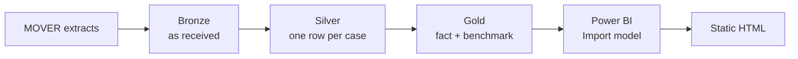

# OR Scheduling Reliability & Cost Exposure

How far do operating room cases run from their own historical benchmark, where does that variation concentrate, and what does it cost?

### **[Open the interactive dashboard →](https://thrinesh13.github.io/OR-Scheduling-Reliability-Analytics/)**

No sign-in, no install. Static HTML reproduction of the Power BI report.

| 48,118 | 418 | 54.1 min | $15.8M to $27.1M |
|:---:|:---:|:---:|:---:|
| Cases analyzed | Procedures | Mean absolute deviation | Annual gross exposure |

---

## The finding

Surgery is usually assumed to run late. Measuring both directions says something more useful.

| Versus the procedure's historical median | Cases | Share |
|---|---:|---:|
| More than 30 min **early** | 11,339 | 23.6% |
| Within ±30 min | 22,481 | 46.7% |
| 30 to 60 min late | 5,077 | 10.5% |
| More than 60 min late | 9,221 | 19.2% |

**Estimates are imprecise in both directions, by comparable amounts.** Fewer than half of all cases land inside a ±30 minute window.

Overruns cost overtime and bumped cases. Early finishes cost idle staffed rooms. Only the first half is normally quantified.

---

## What's in here

| Path | What it is | How to open |
|---|---|---|
| [`index.html`](index.html) | Interactive dashboard, self-contained | [In a browser](https://thrinesh13.github.io/OR-Scheduling-Reliability-Analytics/) |
| [`powerbi/`](powerbi/) | PBIP project: semantic model as TMDL, report as PBIR, all DAX in plain text | Readable on GitHub. To open in Desktop, see [`powerbi/MODEL_REFERENCE.md`](powerbi/MODEL_REFERENCE.md) |
| [`notebooks/`](notebooks/) | Bronze, Silver and Gold transformations | Readable on GitHub. Runs in Fabric against your own MOVER copy |
| [`docs/`](docs/) | Modeling, data-quality and lineage decisions | Readable on GitHub |

> The dashboard is a **reproduction**, not an embedded Power BI report. It carries a fixed aggregate snapshot and does not refresh from Fabric.
>
> Power BI's Publish to web needs a live Pro or PPU licence, so a hosted link dies when a trial lapses. This one does not.

---

## How it was built

**Bronze** keeps the four extracts as strings and reconciles counts against source.

**Silver** resolves duplicates, parses timestamps, repairs what it can, and flags every value it changed.

**Gold** applies eligibility and splits into two grains: a case-level fact table and a procedure-level benchmark. A procedure needs at least 30 qualifying cases to earn a benchmark.

| Checkpoint | Rows |
|---|---:|
| Raw `patient_information` | 65,728 |
| After trim and exact deduplication | 64,362 |
| After duplicate `log_id` resolution | 64,354 |
| Final Silver | 64,353 |
| With a usable OR duration | 57,861 |
| **Gold cohort** | **48,118** |

---

## Results

| Measure | Result |
|---|---:|
| Within ±30 min of benchmark | 46.7% |
| Outside ±30 min | 53.3% |
| Mean absolute deviation | 54.1 min |
| Median absolute deviation | 33.0 min |
| Annualized absolute deviation | ~452,335 min |
| Gross exposure at $35/min | $15.8M |
| Gross exposure at $60/min | $27.1M |

The mean sitting well above the median means a minority of large deviations pulls the average up. That is why the report leads with distribution rather than an average.

**The cleaning barely moved the numbers.** Mean absolute deviation went 54.0 to 54.1 and the median stayed at 33.0, after removing 1,366 duplicate rows, repairing 13 corrupt timestamps and excluding one unexplainable case. That is not wasted work. It is a measured demonstration that the conclusions survive the defects found.

---

## Read this before quoting a number

**The benchmark is not a schedule.** The source does not record what was booked. "Expected" means the procedure's historical median, so this measures predictability against history, not schedule adherence.

**The dollar figures are a scenario.** Total absolute deviation divided by the 5.75-year span, times two illustrative rates. Gross scheduling error, not recoverable waste.

**The benchmark is retrospective** and has not been validated on a holdout set.

**Rare procedures are excluded.** Anything under 30 qualifying cases, which is 16.1% of the operative population. Those are too infrequent to support a reliable median at all.

**No calendar analysis is possible.** MOVER shifts each patient's dates independently, so seasonality, weekday and year-over-year effects cannot be read.

**Age tops out at 90** under HIPAA de-identification, so the oldest band is a mixed group.

This analysis shows *where* variation happens. It does not explain why, or establish that it can be reduced.

---

## Documentation

| Document | Covers |
|---|---|
| [Model reference](powerbi/MODEL_REFERENCE.md) | Every column and measure in the semantic model, plus how to open the PBIP |
| [Dashboard guide](docs/DASHBOARD_GUIDE.md) | Reading the visuals, filters, and the review categories |
| [Data quality](docs/DATA_QUALITY.md) | Profiling, duplicates, timestamp repairs, cohort rules |
| [Data lineage](docs/DATA_LINEAGE.md) | Source to Bronze to Silver to Gold to report, field by field |

---

## Data and tech

Source is [MOVER](https://doi.org/10.24432/C5VS5G), a de-identified perioperative dataset from UC Irvine Medical Center. It requires a data-use agreement, so no raw records are committed here. Four extracts totaling about 1.88 million rows were staged; only patient information continues past Bronze.

Built on Microsoft Fabric (lakehouse, Delta, SQL analytics endpoint), PySpark and Spark SQL, and Power BI with an Import-mode semantic model in TMDL and a PBIR report definition.
