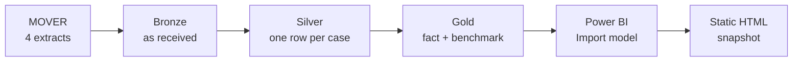

# OR Scheduling Reliability & Cost Exposure

### Turning 1.88M perioperative records into a prioritized scheduling review, with a dollar figure attached

### **[▶ Open the live dashboard](https://thrinesh13.github.io/OR-Scheduling-Reliability-Analytics/)**

*No sign-in. No install. No Power BI licence.*

| **48,118** | **418** | **54.1 min** | **$15.8M–$27.1M** |
|:---:|:---:|:---:|:---:|
| Cases analyzed | Procedures benchmarked | Mean absolute deviation | Annual gross exposure |

---

## The business case

Operating room time is among the most expensive capacity a hospital schedules, and **every booking rests on an estimate of how long the case will take**. When that estimate is wrong the cost is immediate: overruns trigger overtime and bump the cases behind them, while early finishes leave a fully staffed room idle.

This project measures how far real cases fall from their own procedure's historical benchmark, **locates where that variance concentrates**, and prices it.

## What this demonstrates

| Capability | What I built to show it |
|---|---|
| **Data engineering** | Bronze, Silver and Gold layers in Microsoft Fabric over four source extracts, using PySpark and Spark SQL against Delta tables |
| **Data quality** | Profiled and repaired a timestamp defect the source documentation got wrong, cross-validated against an independent clock, and flagged every value changed |
| **Dimensional modeling** | Two deliberate grains, a case-level fact table and a procedure-level benchmark, with the cohort rule enforced in exactly one place |
| **DAX and BI development** | 15 measures, a four-way timing classification, and a two-axis review scoring model driving slicers and a scatter legend |
| **Analytical judgment** | Reframed the question, rejected a normalization step on evidence, and separated a measured result from a priced scenario |

> [!NOTE]
> Full model documentation lives in **[`powerbi/MODEL_REFERENCE.md`](powerbi/MODEL_REFERENCE.md)**: every column, every measure, and the modeling pitfalls hit along the way.

---

## The finding

**Surgery is usually assumed to run late. Measuring both directions says something more useful.**

| Versus the procedure's historical median | Cases | Share |
|---|---:|---:|
| More than 30 min **early** | 11,339 | **23.6%** |
| **Within ±30 min** | 22,481 | **46.7%** |
| 30 to 60 min **late** | 5,077 | 10.5% |
| More than 60 min **late** | 9,221 | 19.2% |

> [!IMPORTANT]
> **Duration estimates are imprecise in both directions, by comparable amounts.** 29.7% of cases run more than 30 minutes long. 23.6% finish more than 30 minutes early. **Fewer than half land inside a ±30 minute window at all.**
>
> Only the overrun half of this is normally quantified. Both halves cost money.

### Results

| Measure | Result |
|---|---:|
| Within ±30 min of benchmark | **46.7%** |
| Outside ±30 min | **53.3%** |
| Mean absolute deviation | **54.1 min** |
| Median absolute deviation | **33.0 min** |
| Annualized absolute deviation | ~452,335 min |
| Gross exposure at $35/min | **$15.8M** |
| Gross exposure at $60/min | **$27.1M** |

The **mean sitting well above the median** means a minority of large deviations pulls the average up. That is why the report leads with the distribution rather than a single average.

> [!TIP]
> **The cleaning barely moved the numbers, and that is the point.** Mean absolute deviation went 54.0 to 54.1 and the median held at 33.0, after removing 1,366 duplicate rows, repairing 13 corrupt timestamps and excluding one case whose defect could not be explained.
>
> That is not wasted work. It is **a measured demonstration that the conclusions survive the defects found**, which is a stronger claim than never having checked.

---

## How it was built

**Bronze** keeps all four extracts as strings and reconciles counts against source.

**Silver** resolves duplicates, parses timestamps, repairs what it can, and **flags every value it changed**.

**Gold** applies eligibility and splits into two grains. A procedure needs **at least 30 qualifying cases** to earn a benchmark, and that rule lives in exactly one join.

| Checkpoint | Rows |
|---|---:|
| Raw `patient_information` | 65,728 |
| After trim and exact deduplication | 64,362 |
| After duplicate `log_id` resolution | 64,354 |
| Final Silver | 64,353 |
| With a usable OR duration | 57,861 |
| **Gold analysis cohort** | **48,118** |

---

## Read this before quoting a number

> [!WARNING]
> **The benchmark is not a schedule.** The source does not record what was booked. "Expected" means the procedure's **historical median**, so this measures predictability against history, not schedule adherence.
>
> **The dollar figures are a scenario, not a loss.** Total absolute deviation divided by the 5.75-year span, times two illustrative rates. This is **gross scheduling error, not recoverable waste**.

| Limit | Why it matters |
|---|---|
| Benchmark is retrospective | Not validated against a holdout set |
| Rare procedures excluded | Under 30 qualifying cases, **16.1% of the operative population**, too infrequent for a reliable median |
| No calendar analysis | Dates are shifted per patient, so seasonality and weekday effects cannot be read |
| Age tops out at 90 | HIPAA de-identification, so the oldest band is a mixed group |

**This analysis shows *where* variation happens.** It does not explain why, and it does not establish that it can be reduced.

---

## What's in here

| Path | Contents | How to open |
|---|---|---|
| **[`index.html`](index.html)** | Interactive dashboard, fully self-contained | **[In a browser](https://thrinesh13.github.io/OR-Scheduling-Reliability-Analytics/)** |
| **[`powerbi/`](powerbi/)** | PBIP project: semantic model as TMDL, report as PBIR, **all DAX in plain text** | Readable on GitHub. Desktop setup in [`MODEL_REFERENCE.md`](powerbi/MODEL_REFERENCE.md) |
| **[`notebooks/`](notebooks/)** | Bronze, Silver and Gold transformations | Readable on GitHub. Runs in Fabric |
| **[`docs/`](docs/)** | Modeling, data-quality and lineage decisions | Readable on GitHub |

> [!CAUTION]
> The dashboard is a **reproduction**, not an embedded Power BI report. It carries a fixed aggregate snapshot and does not refresh from Fabric.
>
> Power BI's Publish to web requires a live Pro or PPU licence, so a hosted link dies when a trial lapses. **This one does not.**

### Documentation

| Document | Covers |
|---|---|
| **[Model reference](powerbi/MODEL_REFERENCE.md)** | Every column and measure in the semantic model, plus how to open the PBIP |
| **[Dashboard guide](docs/DASHBOARD_GUIDE.md)** | Reading the visuals, the filters, and the review categories |
| **[Data quality](docs/DATA_QUALITY.md)** | Profiling, duplicates, timestamp repairs, cohort rules |
| **[Data lineage](docs/DATA_LINEAGE.md)** | Source to Bronze to Silver to Gold to report, field by field |

---

## Data and stack

Source is **[MOVER](https://doi.org/10.24432/C5VS5G)**, a de-identified perioperative dataset from UC Irvine Medical Center. It requires a data-use agreement, so **no raw records are committed here**. Four extracts totaling about 1.88 million rows were staged; only patient information continues past Bronze.

**Microsoft Fabric** (lakehouse, Delta tables, SQL analytics endpoint) · **PySpark** and **Spark SQL** · **Power BI** with an Import-mode semantic model authored in **TMDL** and a **PBIR** report definition · **DAX**
