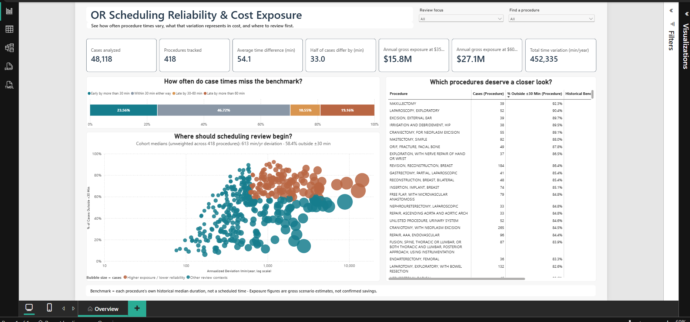
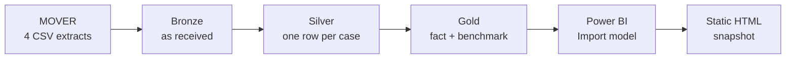
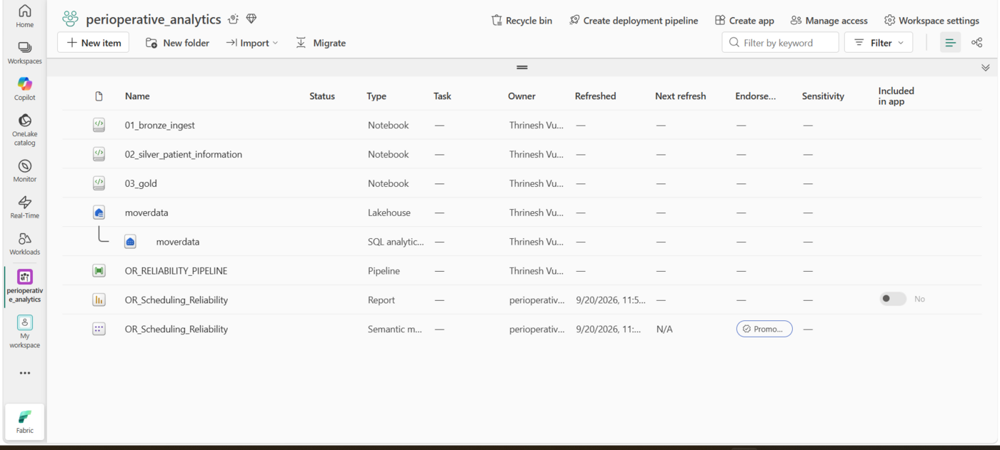
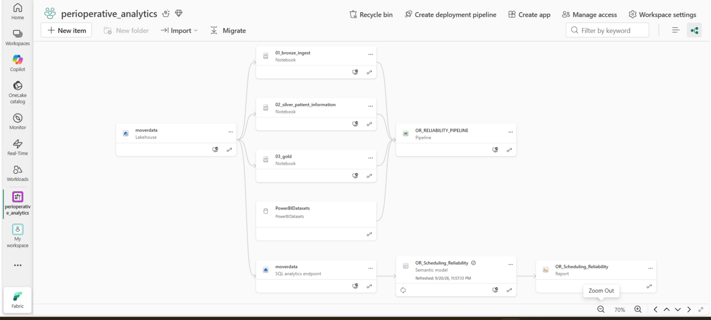
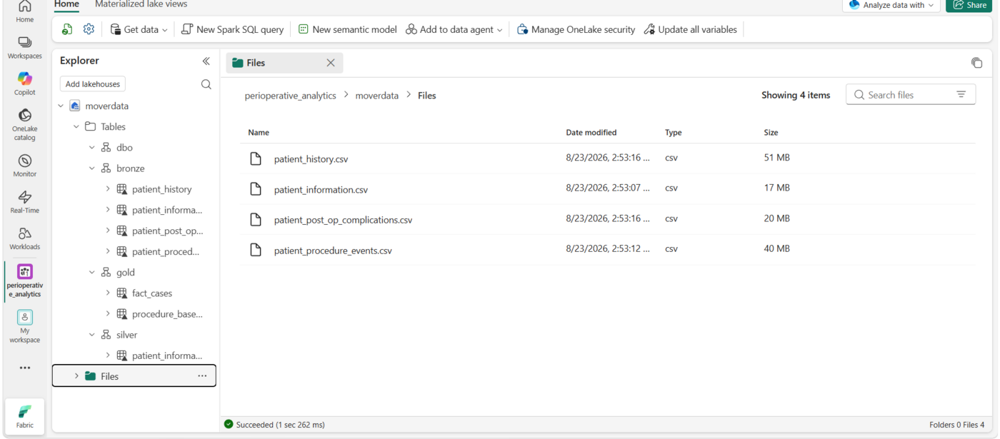
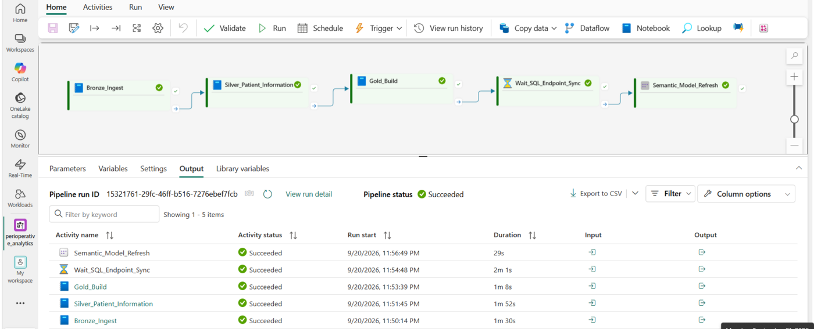
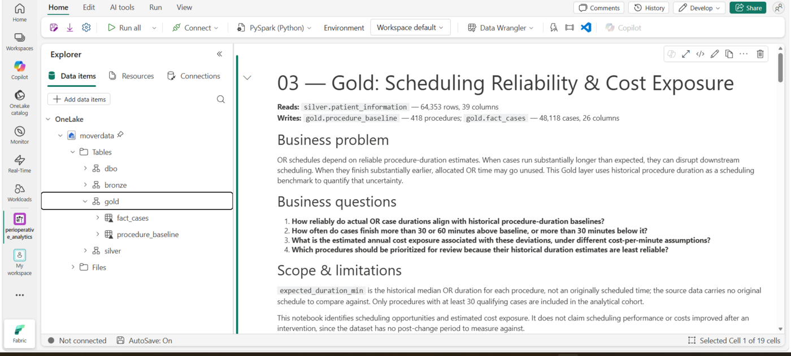
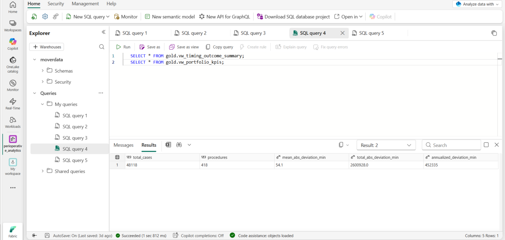
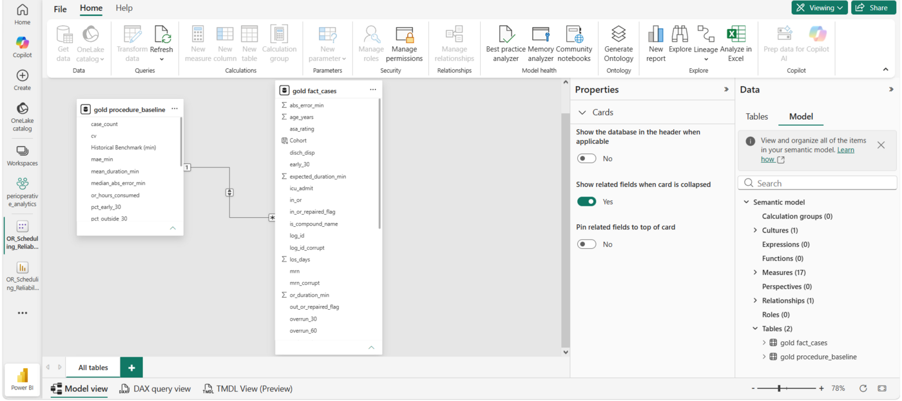
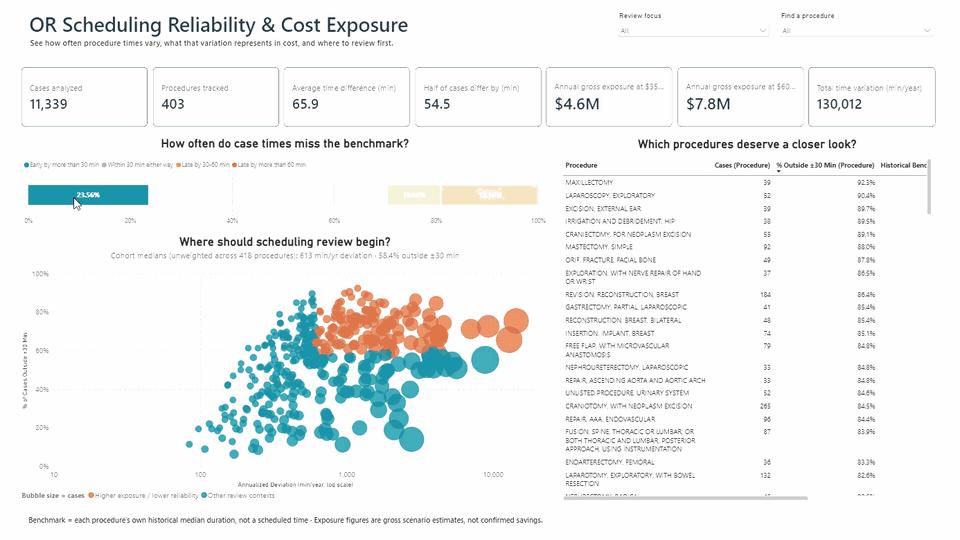

# OR Scheduling Reliability & Cost Exposure

**Measuring how predictable operating room case durations really are, pricing the gap, and ranking which procedures a scheduling review should open first.**

### **[▶ Open the live dashboard](https://thrinesh13.github.io/OR-Scheduling-Reliability-Analytics/)**

*No sign-in. No install. No Power BI licence.*

| **48,118** | **418** | **5.75 years** | **1 site** |
|:---:|:---:|:---:|:---:|
| Surgical cases | Procedure types | Of records | US academic medical centre |

---

## In one paragraph

Every surgery booked in a hospital starts with an estimate of how long it will take. That estimate decides the room, the start time, the staff held for it, and how many other cases fit behind it. Almost nobody checks afterwards whether it was any good. This project checks it, across 48,118 operations, and turns the answer into a ranked list of which procedures are worth a scheduling committee's time.

## What this is, and what it is not

Read this before quoting anything below.

| This project **is** | This project **is not** |
|---|---|
| A measurement of how far each case runs from **its own procedure's historical duration**, and how consistently | A study of **schedule adherence**. The source records no booked time, so nothing here compares against a plan |
| A **ranked review list**: all 418 procedures scored on exposure and on reliability at the same time | A **savings claim**. The dollar figure sizes the uncertainty, not money waiting to be collected |
| A statement of **where** duration variance concentrates | An explanation of **why** it happens. No causal work was attempted |
| A working end-to-end build that **refreshes on one run** | A **prediction model**. There is no case-level forecast and no holdout validation |
| Evidence from **one hospital, five and a half years** | A **benchmark for other hospitals**. Nothing here is claimed to generalize |

The distinction that matters most: **this measures the size of the uncertainty, not the size of anyone's mistake.** The section on whether better scheduling would close the gap explains why those are different quantities, and why this data cannot separate them.

---

## The decision it supports

> [!NOTE]
> **Which procedures should a scheduling review take up first, and what is the case for spending time on each one?**

Most OR reporting ranks procedures on one thing, usually volume or total minutes. That buries the difference between a procedure that is large but behaves predictably and one that is small but erratic, and those two need opposite responses.

This scores every procedure on both at once. Annualized deviation stands in for size. The share of cases landing outside a 30 minute window stands in for reliability. Plotting the two against the cohort medians splits the portfolio into four groups, and the group above both lines is the review agenda.

**Who uses it and for what:**

| Audience | Decision it informs |
|---|---|
| **Perioperative and OR leadership** | Which procedures go on the review agenda, in what order |
| **Scheduling and block time committees** | How much time to allow per procedure, and in which direction to adjust |
| **Finance and capacity planning** | Whether a capacity problem is a booking problem before capital is committed |

---

## What the analysis found

### 1. Misses run in both directions, in comparable volume

| Versus the procedure's historical median | Cases | Share |
|---|---:|---:|
| More than 30 min **early** | 11,339 | **23.56%** |
| **Within ±30 min** | 22,481 | **46.72%** |
| 30 to 60 min **late** | 5,077 | 10.55% |
| More than 60 min **late** | 9,221 | 19.16% |

Fewer than half of all cases land inside a half hour window. Standard OR reporting counts only the late group, because late cases generate overtime and complaints while nothing at all flags a room that finishes early. That leaves **roughly 45% of the problem invisible** in the reports leadership currently receives.

### 2. The average describes almost nobody

Mean absolute deviation is **54.1 minutes**. The median is **33.0**. Half of all cases sit within 33 minutes of benchmark and a minority of large misses drags the average more than 20 minutes above that.

Any target built on the average would be wrong for the common case and still too generous for the tail, which is why the report leads with the distribution and why the two figures are reported side by side rather than one of them alone.

### 3. Half the exposure sits in a third of the procedures

Scored against both cohort medians, 613 min/yr of deviation and a 58.4% miss rate, **133 of 418 procedures land above both lines**.

| | Procedures | Cases | Annual deviation |
|---|---:|---:|---:|
| High exposure **and** low reliability | **133** (31.8%) | 18,296 (38.0%) | **242,323 min (53.6%)** |
| Everything else | 285 | 29,822 | 210,012 min |

This is what makes the analysis usable. A list of 418 procedures gets read once and abandoned. A list of 133, ordered, with the size of each attached, is a few committee meetings of work.

### 4. A sixth of the portfolio is already reliable

**73 procedures keep more than 70% of their cases inside the ±30 minute band**, and 42 of those stay above 80%. These are not thin samples.

| Procedure | Cases | Benchmark | Outside ±30 min |
|---|---:|---:|---:|
| DILATION AND CURETTAGE | 320 | 62 min | 11.3% |
| HYSTEROSCOPY, WITH BIOPSY OR POLYPECTOMY | 192 | 73 min | 12.5% |
| IR PLCMT TUNNELED CATH | 143 | 73 min | 13.3% |
| BIOPSY, MUSCLE | 106 | 70 min | 8.5% |

Knowing where the estimates already work is worth as much as knowing where they do not, because it stops attention going to problems that do not exist. It also raises an obvious question, since every procedure on that list is short.

### 5. The ±30 minute yardstick partly measures procedure length

| Procedure length | Benchmark range | Outside ±30 min | Mean error as share of benchmark |
|---|---|---:|---:|
| Shortest quarter | 28 to 110 min | **25.4%** | 32.9% |
| Second quarter | 111 to 165 min | 54.0% | 34.3% |
| Third quarter | 165 to 252 min | 65.4% | 29.6% |
| Longest quarter | 252 to 601 min | **74.2%** | **24.4%** |

The miss rate triples across the length range. Proportional accuracy moves the opposite way and is slightly better for long procedures. A fixed 30 minute band is a loose tolerance on a one hour case and a tight one on a seven hour case.

Two high volume procedures show the cost of that.

| Procedure | Cases | Benchmark | Outside ±30 min | Mean error vs benchmark |
|---|---:|---:|---:|---:|
| CABG (coronary artery bypass graft) | 416 | 414 min | 68.0% | **14.4%** |
| EGD (esophagogastroduodenoscopy) | 434 | 67 min | **32.9%** | 43.6% |

CABG is among the most proportionally predictable procedures in the portfolio and the fixed band files it with the misses. EGD looks acceptable while its typical case lands nearly half a benchmark away. **A committee working the ±30 list would review the wrong one of these two.**

Absolute minutes are still what the schedule grid is made from, so a 150 minute swing on a long case is a real capacity problem whatever share of the case it represents. Both yardsticks are needed and the report currently carries only one.

---

## What it is worth

Translate the deviation into the two units a hospital actually manages, time and money.

| | Per year |
|---|---:|
| Total absolute deviation | 452,335 min, or **7,539 hours** |
| Share of the room time those cases consumed | **close to 28%** |
| Room time lost to cases finishing early | **2,167 hours** |
| Gross exposure at $35 per OR minute | **$15.8M** |
| Gross exposure at $60 per OR minute | **$27.1M** |

The early finish line is the one that changes the conversation. Spread across a working year it is **roughly one operating room standing empty every single day**, fully staffed and paid for, and no existing report surfaces it. For anyone weighing an extra room, an extra shift or an extra surgical team, that is worth establishing before capital is committed.

> [!WARNING]
> **The dollar range is a scenario, not a loss.** It takes total absolute deviation, divides by the span of the extract, and multiplies by two illustrative rates. Read it as an upper bound on what better estimating could address, not as recoverable savings. The next section explains how much of it is realistically in play.

---

## Would better scheduling close the gap?

Mostly not, and saying otherwise is the fastest way to lose a clinical audience.

The benchmark is the **median of what actually happened** for each procedure. By construction roughly half that procedure's cases fall above it and half below. So most of what is measured here is the natural spread of surgical durations around their own centre. Book every case at exactly its procedure's median, perfectly, with no human error at all, and you reproduce almost this same number. Surgery is not manufacturing, and a case runs long because of what the surgeon finds once they are in there.

**What scheduling genuinely can act on is the asymmetry.**

| | Cases | Total minutes | Average miss |
|---|---:|---:|---:|
| Finished more than 30 min **early** | 11,339 | 747,570 | 65.9 min |
| Ran more than 30 min **late** | 14,298 | 1,541,229 | **107.8 min** |

Late cases outnumber early ones by only 1.26 to 1, yet they carry **2.06 times the minutes**. A case that runs long runs long by half again as much as one that runs short, and this holds for **388 of 418 procedures**. It is a property of surgical duration, not a quirk of a few specialties.

That makes the choice of booking anchor a real decision. Sitting at the median means minutes lost to overruns will systematically exceed minutes recovered from early finishes, a net drift of about **2,300 hours a year**. Booking at the 60th or 70th percentile trades some idle room for less overtime. Which is correct depends on local costs, and at present that tradeoff is being made by default rather than deliberately.

**Two other pieces are reducible.** Procedure naming, because names covering more than one operation pool cases of different scope into one benchmark and inflate its spread. And the estimate itself, because it currently uses procedure name alone while patient acuity, anesthesia type, admission status, age and start hour all sit unused in the fact table. Conditioning on those would shrink the residual by definition. How much is an open question and it is testable with columns already loaded.

---

## What to do first

> [!IMPORTANT]
> These say where to look and what to check. None has been tested against an intervention.

**1. Work the 133 procedures above both cohort medians, in order.** Highest coverage returned per hour of review time.

**2. Set the booking anchor per procedure, on purpose.** The blanket instinct to pad everything fixes overruns and makes the idle hours worse. Given the asymmetry above, the percentile is the lever, and it should differ by procedure.

**3. Check the benchmark before checking the team.** A high miss rate can mean an unstable true duration, a genuinely variable patient mix, or a naming problem. **207 compound procedure names** were flagged in this data, each covering more than one operation, and they are the cheapest thing to fix first.

**4. Report a proportional band alongside the fixed one.** Otherwise long, well estimated procedures such as CABG crowd out the ones that need attention. Per procedure standard deviation and coefficient of variation are already computed in `gold.procedure_baseline` and currently unused by the report.

**5. Start recording booked duration.** The single change that would let the next version separate an estimating problem from a variability problem, which is the question leadership actually asks.

---

## How the numbers were produced

Source is **[MOVER](https://doi.org/10.24432/C5VS5G)**, a de-identified perioperative dataset released by UC Irvine Medical Center. Access requires a data use agreement, so **no raw records are committed here**. Four extracts totaling about 1.88 million rows were staged; only patient information carries through to the analysis.

| Checkpoint | Rows | What happened |
|---|---:|---|
| Raw `patient_information` | 65,728 | Source, as received |
| After trim and exact deduplication | 64,362 | 1,366 identical rows removed |
| After duplicate `log_id` resolution | 64,354 | One deterministic row kept per case |
| Final Silver | 64,353 | One unexplainable timestamp outlier excluded |
| With a usable OR duration | 57,861 | Both OR timestamps present and repaired |
| **Gold analysis cohort** | **48,118** | Duration and procedure volume eligibility applied |

**Did cleaning change the answer?** Barely, and establishing that was the point of running it. The mean moved from 54.0 to 54.1 and the median held at 33.0 after removing the duplicates, repairing 13 corrupt timestamps and excluding one case whose defect could not be explained. Duplicates that copy typical rows shift counts and sums rather than averages, so the headline averages were always going to hold. The totals were not, and the exposure figure runs off a sum.

**Method decisions worth stating:**

A **median** benchmark rather than a mean, because the duration distribution is right skewed and a mean would classify a large share of ordinary cases as finishing early.

A **30 case floor** for a procedure to earn a benchmark. Tested rather than assumed: the median miss rate improves only from 61.5% in the lowest volume quartile to 55.2% in the highest, and proportional error is flat across all four, so a higher floor would cost coverage and buy very little.

**Early finishes counted**, which changed the conclusion, since they occur nearly as often as overruns and consume the same staffed room.

**Portfolio percentages taken from the case table, never averaged from the 418 procedure rates.** The two differ: 58.4% unweighted against 53.28% case weighted. Both are correct and they answer different questions.

---

## How it was built

**Microsoft Fabric** lakehouse with Delta tables and a SQL analytics endpoint · **PySpark** and **Spark SQL** across all three layers · **Data Factory pipeline** chaining the notebooks and the semantic model refresh · **Power BI Desktop** for the data model and the report · **DAX**

| Layer | What it does |
|---|---|
| **Bronze** | Loads all four extracts as strings with `inferSchema=False`, then reads each Delta table back and reconciles row and column counts against the source |
| **Silver** | Resolves duplicates, parses timestamps, repairs what the evidence supports, and flags every value it changes |
| **Gold** | Applies eligibility and splits into two grains. The 30 case rule lives in exactly one join |
| **Data model** | Two tables, one bidirectional relationship, 17 measures and five calculated columns |

All three notebooks are idempotent, so the chain runs end to end from the pipeline and lands in the same state every time.

**The report** is one page in Power BI Desktop over the Gold tables in Import mode: ten KPI cards, a 100% stacked bar for the timing distribution, a scatter plotting all 418 procedures against two fixed cohort reference lines, a sortable procedure table and two slicers, with cross-filtering configured so a selection in any visual re-scopes the page. Import was chosen over Direct Lake because the cohort fits comfortably in memory and the report is read far more often than the data changes.

**The relationship is bidirectional, and that had a cost.** It was needed so selecting a procedure through a slicer, a table row or a scatter bubble also filters the case level visuals. It also breaks `ALL()` on a column that is simultaneously a chart's category axis, because the relationship re-propagates the narrowed selection, and a ratio measure built that way can be quietly wrong per category without ever erroring. The timing chart sidesteps it by binding to raw case counts and letting the stacked bar compute its own percentages. Full build notes are in [`MODEL_REFERENCE.md`](powerbi/MODEL_REFERENCE.md).

### The build in Fabric

**Workspace.** Lakehouse, three notebooks, orchestration pipeline, semantic model and report, with the model endorsed as Promoted.

**Lineage.** The dependency graph Fabric derives, from lakehouse through notebooks to the semantic model and report.

**Medallion layers.** `bronze`, `silver` and `gold` are real schemas in the lakehouse rather than a naming convention on a flat table list.

**Orchestration.** Bronze, Silver, Gold, a wait for SQL endpoint sync, then the semantic model refresh. All five activities green, about 7 minutes end to end.

**Notebooks.** Each opens with what it reads, what it writes, the business questions it serves and its own scope limits.

**Figures at source.** The headline numbers queried directly from the Gold tables through the SQL analytics endpoint.

**Data model.** Two grains, one bidirectional relationship, 17 measures.

*Selecting a timing outcome, a review category or a single procedure re-scopes every visual on the page.*

---

## Limits

> [!CAUTION]
> **The benchmark is not a schedule.** Expected duration means the procedure's historical median, because the source records no booked time.

| Limit | Consequence |
|---|---|
| Uncertainty and estimating error are not separable | Without a booked duration, a poor estimate and a genuinely variable case look identical |
| The benchmark is retrospective | Built from the same cases it is measured against, with no holdout period |
| The fixed ±30 band favours short procedures | Quantified in finding 5. Any ranking from it needs a proportional check alongside |
| Rare procedures are excluded | 16.8% of cases with a usable duration fall outside the cohort, most for procedure volume |
| No calendar analysis is possible | Dates are shifted per patient, so seasonality, weekday and trend effects cannot be read |
| Age is top-coded at 90 | HIPAA de-identification leaves the oldest band a mixed group |
| OR duration is room occupancy | Entry to exit, not incision to close, so turnover and positioning sit inside the measure |
| Cost rates are assumptions | $35 and $60 per minute are illustrative, not any institution's costed rates |

---

## What is in this repository

| Path | Contents |
|---|---|
| **[`index.html`](index.html)** | The interactive dashboard, self-contained. **[Open it](https://thrinesh13.github.io/OR-Scheduling-Reliability-Analytics/)** |
| **[`notebooks/`](notebooks/)** | Bronze, Silver and Gold transformations. Readable here, runs in Fabric |
| **[`powerbi/`](powerbi/)** | The Power BI project in folder format, so the data model and every DAX measure are readable without opening the file |
| **[`docs/`](docs/)** | Modeling, data quality and lineage decisions |
| **[`assets/`](assets/)** | Report screenshots, the interaction recording and the Fabric captures used above |

| Document | Covers |
|---|---|
| **[Model reference](powerbi/MODEL_REFERENCE.md)** | Every column and measure, plus how to open the project in Desktop |
| **[Dashboard guide](docs/DASHBOARD_GUIDE.md)** | Reading the visuals, the filters and the review categories |
| **[Data quality](docs/DATA_QUALITY.md)** | Profiling, duplicates, timestamp repairs, cohort rules |
| **[Data lineage](docs/DATA_LINEAGE.md)** | Source to Bronze to Silver to Gold to report, field by field |

> [!NOTE]
> The hosted dashboard reproduces the Power BI report rather than embedding it. It carries a fixed aggregate snapshot and does not refresh from Fabric. Power BI's Publish to web needs a live Pro or PPU licence, so a hosted link dies when a trial lapses. This one does not.
