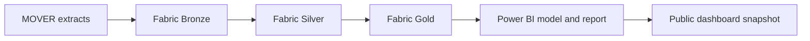

# OR Scheduling Reliability & Cost Exposure


An end-to-end Microsoft Fabric project that measures operating room (OR) scheduling reliability and cost exposure. It compares actual case durations against historical procedure benchmarks to flag which procedures need a scheduling review, and quantifies the cost of the variation.

**[View the live dashboard →](https://thrinesh13.github.io/OR-Scheduling-Reliability-Analytics/)**


### At a glance

| 48,118 | 418 | 46.7% | $15.8M to $27.1M |
|:---:|:---:|:---:|:---:|
| Qualifying cases | Procedures analyzed | Within ±30 min of benchmark | Annual gross exposure range |

---

## Approach

OR time is limited and expensive. Cases that run much longer or shorter than expected create problems for room scheduling, staffing, and downstream planning. This analysis identifies which procedures vary the most, where that variation adds up to the highest cost, and where a review should start.

A Bronze, Silver, and Gold data pipeline in Microsoft Fabric feeds a Power BI semantic model and report. A public HTML version of the dashboard lets anyone explore the findings without a Power BI account.

The analysis keeps two questions separate:

| Lens | What it measures | Why it matters |
|---|---|---|
| **Reliability** | Share of a procedure's cases that fall more than ±30 minutes from its historical benchmark | Shows how predictable a typical case is |
| **Exposure** | Total absolute time difference across all cases for a procedure, annualized | Shows where variation adds up at scale |

A procedure can have high exposure without being unreliable. A common procedure can accumulate a lot of total variation even when most of its individual cases are close to benchmark.

---

## The data

> **Note:** The data does not include the duration originally booked for each case. "Expected" duration here means the historical median for that procedure, not the scheduled time slot. This measures predictability against history, not schedule adherence.

The source is [MOVER](https://doi.org/10.24432/C5VS5G), a de-identified perioperative dataset from UC Irvine Medical Center. Access requires a data-use agreement, so the raw records are not included in this repository.

Four source tables were staged, totaling about 1.88 million records. Only the patient information table feeds the current analysis. The procedure-history, procedure-event, and complication tables are staged for possible future work.

The pipeline works in three layers:

1. **Bronze** preserves the four source extracts as Delta tables and checks ingestion counts.
2. **Silver** cleans the patient information records, resolves duplicates, standardizes procedure names, and flags timestamp issues.
3. **Gold** applies eligibility rules and builds a case-level fact table and a procedure-level benchmark table.

Power BI then imports the Gold tables through the Fabric SQL endpoint, and DAX measures support the filtering and prioritization in the report.

The final cohort covers 48,118 qualifying cases across 418 procedures. A procedure needs at least 30 qualifying cases to be included in the comparison.



---

## Key findings

| Measure | Result |
|---|---:|
| Cases within ±30 minutes of the procedure benchmark | 46.7% |
| Cases outside ±30 minutes | 53.3% |
| Mean absolute difference | 54.1 minutes |
| Median absolute difference | 33.0 minutes |
| Annualized absolute time variation | 452,335 minutes |
| Annual gross exposure at $35 to $60 per minute | $15.8M to $27.1M |

More than half of all cases differ from their historical benchmark by over 30 minutes. The mean is higher than the median, which means a smaller number of large deviations are pulling the average up.

> The dollar figures are a planning scenario, not a measured loss or a savings forecast. They come from total absolute deviation divided by an assumed 5.75-year observation period, multiplied by two illustrative cost-per-minute rates.

---

## Recommendations

- Start reviews with procedures that combine high exposure and low reliability. Check case volume and the underlying timing distribution before changing any benchmark.
- Test proposed benchmarks against a separate, independent set of cases. A benchmark built and checked on the same cases can look better than it will perform going forward.
- Compare against actual booked durations once that data is available. That is the only way to evaluate real schedule adherence.
- Use your own organization's cost assumptions. The two rates shown here illustrate scale, not actual accounting figures.

---

## Limitations

The benchmark is retrospective and has not been validated against a holdout set of cases. Cases outside the defined duration rules, and procedures with fewer than 30 qualifying cases, are excluded. MOVER shifts each patient's dates independently, so calendar-based trends like seasonality are not reliable in this data. The analysis shows where variation happens. It does not explain why it happens or whether it can be reduced.

---

## Explore further

| Resource | What it covers |
|---|---|
| [Dashboard guide](docs/DASHBOARD_GUIDE.md) | How to read the visuals, use the filters, and interpret the review categories |
| [Data quality and feature engineering](docs/DATA_QUALITY.md) | Duplicate handling, timestamp checks and repairs, cohort rules, validation results |
| [Data lineage](docs/DATA_LINEAGE.md) | Source-to-Bronze-to-Silver-to-Gold flow, table dependencies, metric origins |
| [Transformation notebooks](notebooks/) | The Bronze, Silver, and Gold logic |

The live dashboard is a fixed snapshot. Refreshing Fabric or replacing the CSV exports in `dashboard-data/` does not update it automatically.

---

## Tech stack

Microsoft Fabric (Lakehouse, Delta tables, SQL endpoint), PySpark and Spark SQL, Power BI and DAX.

---

## Project structure

```text
OR-Scheduling-Reliability-Analytics/
├── README.md
├── index.html          # Opens the public dashboard
├── assets/             # Power BI overview image
├── dashboard/          # Interactive HTML dashboard
├── dashboard-data/     # Power BI CSV exports and old-URL redirect
├── docs/               # Guide, data quality, and lineage
└── notebooks/          # Bronze, Silver, and Gold transformations
```
