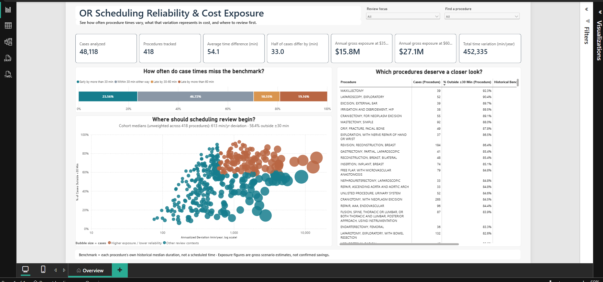

# OR Scheduling Reliability & Cost Exposure

An end-to-end healthcare analytics project that uses historical operating-room (OR) data to evaluate how reliably procedure durations can be estimated, identify procedures that warrant scheduling review, and quantify the scale of associated time and cost exposure.

| Project result | Value |
|---|---:|
| Perioperative records processed | 1.9M+ |
| Curated surgical cases | 48,118 |
| Procedures analyzed | 418 |
| Average absolute difference from benchmark | 54.1 minutes |
| Cases outside ±30 minutes | 53.3% |
| Estimated annual gross cost exposure | $15.8M–$27.1M |

> **Important:** The benchmark is each procedure's historical median OR duration, not its originally booked time. This project measures predictability against history; it does not measure adherence to an actual schedule.

## Business case

Operating rooms are among a hospital's most expensive and capacity-constrained resources. Each room must be staffed, equipped, and scheduled carefully, so unreliable case-duration estimates can affect the rest of the operating day.

When a case runs longer than expected, later cases may be delayed and staffing needs may extend beyond plan. When a case finishes substantially earlier, allocated room time may remain unused. Both directions represent scheduling uncertainty, but operational reporting often focuses only on overruns.

This project treats early finishes and overruns as parts of the same reliability problem. It answers four business questions:

1. How closely do actual OR durations align with historical procedure-duration benchmarks?
2. How often do cases fall more than 30 or 60 minutes above baseline, or more than 30 minutes below it?
3. What annual time and cost exposure is associated with these differences?
4. Which procedures should be prioritized for scheduling review?

The result is a decision-support tool for OR operations, perioperative leaders, and hospital leadership. It identifies where review may create the most value without claiming that the estimated exposure is fully avoidable or recoverable.

## Dataset

The project uses the [MOVER dataset](https://doi.org/10.24432/C5VS5G) (Medical Informatics Operating Room Vitals and Events Repository), a public, de-identified perioperative dataset from the University of California, Irvine Medical Center. Access to the source data requires a signed data-use agreement.

Four source tables were ingested:

| Source | Bronze rows | Purpose |
|---|---:|---|
| Patient information | 65,728 | Case, procedure, patient, anesthesia, and OR timestamps |
| Patient history | 970,741 | Historical patient records |
| Procedure events | 640,223 | Events recorded during procedures |
| Post-operative complications | 203,945 | Post-operative outcomes |

The current analysis is built from the patient-information source. The other three tables are retained in Bronze for future extensions and are not used in the present findings.

The final analytical cohort contains **48,118 cases across 418 procedures**. Procedures with fewer than 30 qualifying cases were excluded so each historical duration benchmark had a minimum supporting volume.

Dataset reference: Samad M, Angel M, Rinehart J, Kanomata Y, Baldi P, Cannesson M. [*Medical Informatics Operating Room Vitals and Events Repository (MOVER): a public-access operating room database*](https://doi.org/10.1093/jamiaopen/ooad084). *JAMIA Open*, 2023.

## Project

### 1. Data engineering in Microsoft Fabric

The data was processed in a Fabric Lakehouse using a medallion design:

| Layer | Role | Output |
|---|---|---|
| Bronze | Preserve the source extracts without transformation | Reproducible raw Delta tables |
| Silver | Standardize fields, resolve duplicates, validate timestamps, and retain flags for repaired values | One analysis-ready row per surgical case |
| Gold | Apply cohort rules, calculate procedure benchmarks, and derive case-level reliability measures | `gold.procedure_baseline` and `gold.fact_cases` |

The detailed timestamp investigations, repair rules, validation results, and record-level exceptions will be documented separately in a dedicated data-quality file. End-to-end table and field movement will be documented separately in a lineage file.

### 2. Analytical model

Each procedure's expected duration is defined as its historical median OR duration. Every qualifying case is compared with that benchmark using:

- `schedule_error_min`: signed difference from baseline
- `abs_error_min`: magnitude of the difference
- `overrun_30`: more than 30 minutes above baseline
- `overrun_60`: more than 60 minutes above baseline
- `early_30`: more than 30 minutes below baseline

The model keeps reliability and accumulated exposure separate. This prevents a high-volume but relatively predictable procedure from being treated the same as a lower-volume procedure with high per-case variability.

### 3. Power BI report

The Power BI report provides:

- Headline KPIs for case volume, procedure count, average and median absolute difference, annualized time variation, and cost exposure
- A timing-outcome view separating early cases, cases within ±30 minutes, 30–60 minute overruns, and overruns above 60 minutes
- A prioritization scatter comparing annualized time variation with the percentage of cases outside ±30 minutes
- A searchable procedure table for detailed review
- Cross-filtering and review categories that support movement from the full cohort to an individual procedure

See [DASHBOARD_GUIDE.md](DASHBOARD_GUIDE.md) for metric definitions, visual behavior, and guidance on interpreting the report.

## Key findings

### Scheduling variation is widespread

Only **46.7%** of cases fall within ±30 minutes of their procedure benchmark. The remaining **53.3%** finish more than 30 minutes early or run more than 30 minutes over baseline.

| Timing outcome | Share of cases |
|---|---:|
| More than 30 minutes above baseline | 29.7% |
| More than 60 minutes above baseline | 19.2% |
| More than 30 minutes below baseline | 23.6% |
| Within ±30 minutes | 46.7% |

The mean absolute difference is **54.1 minutes**, while the median is **33.0 minutes**, showing that larger deviations materially raise the average.

### The exposure is operationally significant

The cohort contains **2,600,928 total absolute deviation minutes**. Annualized over the 5.75-year observation period, this equals approximately **452,335 minutes per year**.

Applying two cost-per-minute scenarios produces an estimated annual gross exposure of:

- **$15.8 million** at $35 per minute
- **$27.1 million** at $60 per minute

These figures are scenario estimates of gross exposure, not measured financial loss or guaranteed recoverable savings.

### No single procedure explains the problem

**Laparotomy, Exploratory** has the highest accumulated deviation but accounts for only **3.2%** of the cohort's total. Exposure is distributed across the procedure mix, supporting a systematic review process rather than a one-procedure fix.

### Prioritization requires both volume and reliability

Procedures can accumulate high total variation because they occur frequently, because their individual cases are difficult to predict, or both. The dashboard therefore compares accumulated exposure and the rate of cases outside ±30 minutes as separate dimensions.

## Limitations

- The source does not contain originally booked case durations. Results compare actual duration with a historical median, so they measure predictability rather than true schedule adherence.
- The benchmark is calculated retrospectively from the same observation window; it has not yet been validated on an independent holdout period.
- MOVER shifts dates separately for each patient. Within-case durations remain usable, but cross-patient calendar analysis such as seasonality, day-of-week patterns, and year-over-year trends is not valid.
- Procedures with fewer than 30 qualifying cases are excluded, so the results do not represent every procedure in the source data.
- The 5.75-year annualization period and the $35/$60 per-minute rates are fixed assumptions.
- The analysis identifies where variation occurs, not why it occurs. It does not demonstrate that the variation was avoidable or that the estimated cost exposure can be recovered.

## Recommendations

1. **Begin with high-exposure, low-reliability procedures.** Use the dashboard's prioritization view to find procedures that combine substantial annualized variation, a high share of cases outside ±30 minutes, and enough volume to make review worthwhile.
2. **Review benchmarks as a repeatable process.** Because exposure is distributed across many procedures, establish a regular benchmark-review cycle instead of correcting only the largest outlier.
3. **Keep reliability and volume separate in operational decisions.** High accumulated exposure does not automatically mean poor per-case predictability.
4. **Validate before changing scheduling policy.** Test revised benchmarks on a later or independent sample and compare them with actual booked durations when schedule data becomes available.
5. **Treat financial estimates as planning scenarios.** Use organization-specific cost assumptions before applying the exposure figures to budgeting or savings targets.

## Future scope

- Test whether patient acuity, anesthesia type, patient class, and other case characteristics explain differences in predictability.
- Validate historical-median benchmarks on a holdout period or independent perioperative dataset.
- Incorporate actual booked start times and planned durations to measure true scheduling accuracy.
- Add interactive cost-per-minute assumptions and scenario controls to the Power BI report.
- Extend the model with procedure events, patient history, and post-operative outcomes where they support clearly defined analytical questions.
- Add role-based access and service-line views if the solution moves toward operational use.
- Create dedicated `DATA_QUALITY.md` and `DATA_LINEAGE.md` documentation for validation evidence, repair logic, exclusions, table lineage, and model dependencies.

## Repository contents

| File | Description |
|---|---|
| [`01_bronze_ingest.ipynb`](01_bronze_ingest.ipynb) | Raw source ingestion into Bronze Delta tables |
| [`02_silver_patient_information.ipynb`](02_silver_patient_information.ipynb) | Cleaning, timestamp validation and repair, procedure-name standardization, and Silver table creation |
| [`03_gold.ipynb`](03_gold.ipynb) | Cohort selection, procedure baselines, case-level measures, findings, and reconciliation checks |
| [`OR_Scheduling_Reliability.pbip`](OR_Scheduling_Reliability.pbip) | Power BI Project entry file |
| [`DASHBOARD_GUIDE.md`](DASHBOARD_GUIDE.md) | Dashboard purpose, metrics, interactions, and interpretation guidance |
| [`PROJECT_NOTES.md`](PROJECT_NOTES.md) | Supporting analytical decisions and known implementation notes |
| [`OR_OVERVIEW.png`](OR_OVERVIEW.png) | Dashboard preview used in this README |

> GitHub does not render PBIP reports interactively. The screenshot and dashboard guide provide a browser-viewable portfolio preview, while the PBIP source is intended for Power BI Desktop and version control.

## Tech stack

- **Microsoft Fabric:** Lakehouse, Spark notebooks, PySpark, Spark SQL, and Delta Lake
- **Power BI Desktop:** Import-mode semantic model, DAX measures, interactive report design, and PBIP source format
- **Development:** SQL, Python, Git, and GitHub

## Project boundary

This project demonstrates data engineering, analytical modeling, data validation, and BI reporting. It supports investigation and prioritization; it does not claim that a scheduling intervention was implemented, that hospital performance improved, or that the estimated exposure is fully recoverable.
